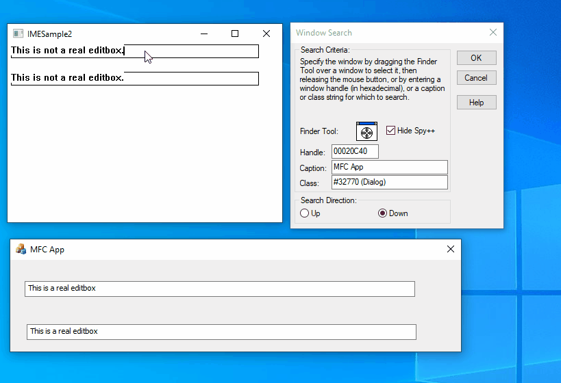
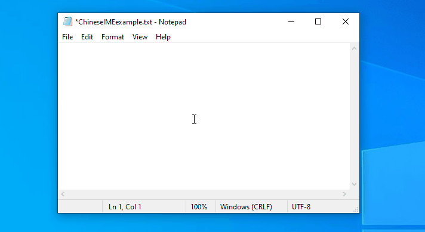
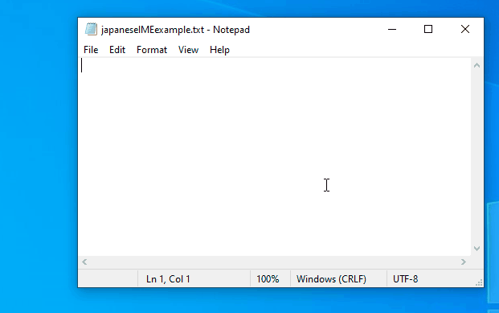
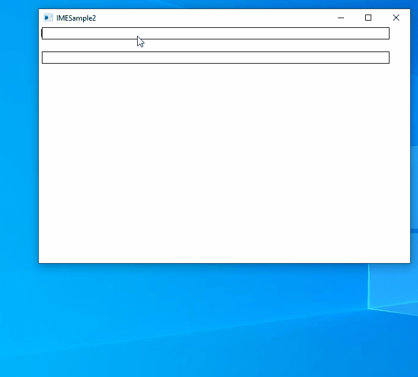

# windowsime
This repo contains the supporting sample application to demonstrate the issues faced with microsoft text service framework APIs for windowless IME support.
Usage of the Text service framework APIs are largely based on https://github.com/zupet/TSF-Test

**Context**  
For regular win32 editboxes, when user selects a control, IME knows that it has switched to different window as  there is differnt window associated with each editbox. But in our product the entire UI is rendered using directx. So there is only one window which windows know about - that the main window. All the controls on this window will be drawn using directx. That is, all the editbox, lable, listbox, etc are custom drawn using directx.  
This sample application is a quick and simple app which sort of imitates that drawing and windowing. This has only one main window and i draw two rectangles as editboxes. Mouse and keyboard events are handled at the window level and will be redirected to the targeted editbox object depending on the clicked area if it belong to it.  
Below you can see the difference between our editbox and editboxes in an MFC app.

Now the problem is,

**#1 We need to programatically stop the ongoing composition on the window and initiate another composition with another string on the same window itself**  
IME doesnt know that user is selecting different editboxes as the IME context here is associated only with the window. So when user types in one editbox and in between selects another editbox and type, in our case, we have to abort the current composition on the main window and initiate another ime composition in the same main window itself. Second editbox may even have some content already as user could be editing the existing content.  

**#2 We need to programatically disable and enable IME depending on which area user has selected.**  

We have numeric editboxes where we should not let user type anything other than numeric values. Or in situations where user just simply clicks on any area in the window where we dont have an editbox and starts typing. In these cases, IME should not be triggered. So we need a way to programatically disable and enable IME just for that process and this should not affect other processes.  

**#3. Controling the candidate list shortcut**  

When japanese is selected, the candidate list numbering is not automatically visible even though candidate list is shown. User has to press down arrow in order for it to be visible. For example, select japanese language and type "kuruma" in notepad. You see the candidate list but there will not be any numbering. If you press down arrow, you see that numbering appear. However for chinese you always see the numbering shortcut in the candidate list. When we use the APIs, we always get the selected candidate index. So even if we type in japanese or chinese, our app shows candidate list shortcut and for japanese these number will not work untill you press down arrow. When IME is enabled, these down arrow press goes to IME and not to application so we cannot even wait for down arrow press to show the numbering in japanese case though that is an ugly solution.  

Below is how notepad shows the candidate list numbering for chinese  

Below is how notepad shows candidate list numbering for japanese. Note that when we type, it doesnt show the numbers untill you press down arrow  

Below is how the numbering is shown in this sample app via APIs. As soon as you type anything, the number is visible even without pressing down arrow. The problem is, in the function TextStore::UpdateUIElement (textsink.cpp) we always get a candidate selection index via 
candidateListUiElement->GetSelection(&selection) even if we have not selected anything.  

**Why do we have two Apps in this repo which are almost same ?**  
With all the trial and errors, in our testing, App2 gives best results for issue 1. That is, App one has only one IME document manager for all the controls and App 2 has total two document managers. In App two, the focus of the document manager is set to a dummmy one when ever user has selected something which doesnt need IME. So when user moves out of one editbox, we set the focus to a dummy document manager and when selecting a control which requires IME, we set the actual document manager where we get all the callbacks. But we dont not know if this is the right approach.  

**Below are the queries raised by my colleague Parmod Kumar** 
  
[How to terminate the in progress composition ?](https://docs.microsoft.com/en-us/answers/questions/731668/ime-how-to-terminate-the-in-progress-composition.html)  
[How to enable/disable IME per process ?](https://docs.microsoft.com/en-us/answers/questions/731701/how-to-enable-amp-disable-ime-input-for-an-applica.html)  
[How to handle candidate list numbering in japanese ?](https://docs.microsoft.com/en-us/answers/questions/731755/ime-how-to-handle-candidate-list-numbering-in-japa.html )  
[Why Japanese IME doesnt work in some machines ?](https://docs.microsoft.com/en-us/answers/questions/731708/ime-japanese-ime-is-not-working-on-window-10-1909.html)  
